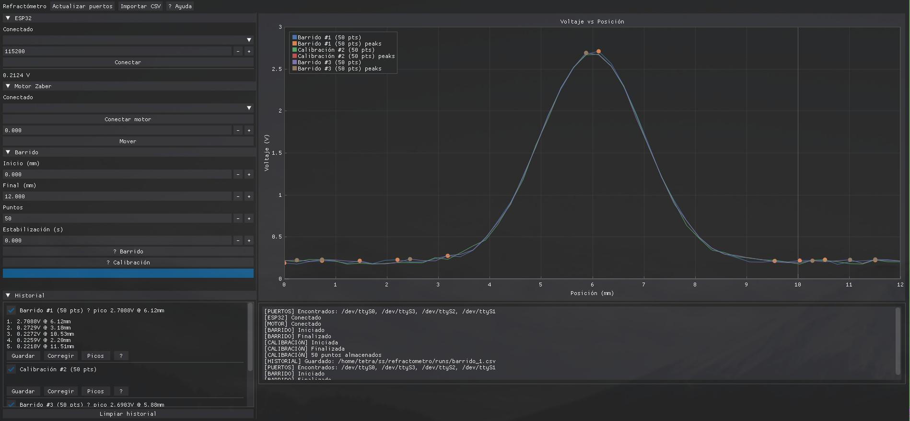

# Refractómetro

Aplicación para controlar un refractómetro motorizado y adquirir datos experimentales.

El programa permite controlar un motor Zaber, adquirir la señal de un sensor mediante un ESP32, realizar barridos y calibraciones, analizar las mediciones y guardar los resultados para su posterior procesamiento.



También incluye un **modo de simulación** que permite utilizar la aplicación sin tener conectado el equipo experimental.

## Descargar y ejecutar

No es necesario instalar Python, Nix ni las dependencias del proyecto para utilizar el refractómetro.

Las versiones ejecutables se publican en la sección **Releases** de GitHub.

### Windows

1. Descarga `refractometro-windows-x86_64.zip` desde la versión más reciente.
2. Extrae el contenido del archivo `.zip`.
3. Abre la carpeta extraída.
4. Ejecuta `refractometro.exe`.

### Linux

1. Descarga `refractometro-linux-x86_64.tar.gz`.
2. Extrae el archivo:

   ```bash
   tar -xzf refractometro-linux-x86_64.tar.gz
   cd refractometro
   ```

3. Ejecuta:

   ```bash
   ./refractometro
   ```

Si Linux indica que el archivo no tiene permisos de ejecución:

```bash
chmod +x refractometro
./refractometro
```

## Probar sin el refractómetro

La aplicación incluye un modo de simulación que permite explorar la interfaz y ejecutar experimentos sin conectar el ESP32 ni el motor Zaber.

Esto resulta útil para familiarizarse con el programa antes de trabajar con el equipo experimental.

En Linux:

```bash
./refractometro --test
```

En Windows:

```bash
refractometro.exe --test
```

En el modo de simulación puedes:

- Ejecutar un Barrido.
- Ejecutar una Calibración.
- Consultar las mediciones en el Historial.
- Calcular y visualizar picos de una corrida.
- Exportar e importar corridas en CSV con metadatos.

## Uso con el refractómetro

### Conectar el equipo

Conecta al ordenador:

- El ESP32, utilizado para adquirir la señal del sensor.
- El motor Zaber, utilizado para desplazar la muestra.

### Seleccionar los dispositivos

1. Abre la aplicación.
2. Pulsa **Actualizar puertos**.
3. Selecciona el puerto correspondiente al ESP32.
4. Selecciona el puerto correspondiente al motor Zaber.
5. Pulsa **Conectar** para el ESP32.
6. Pulsa **Conectar motor** para el motor Zaber.

Cuando ambos dispositivos estén conectados, las opciones de Barrido y Calibración estarán disponibles.

### Realizar una medición

La aplicación permite realizar diferentes tipos de experimentos:

- **Barrido**: realiza una medición a lo largo del intervalo de posiciones seleccionado.
- **Calibración**: permite obtener una curva de calibración.
- **Historial**: muestra las corridas realizadas durante la sesión.
- **Picos**: permite identificar los picos presentes en una corrida.

Los resultados pueden exportarse a CSV para analizarlos posteriormente con otras herramientas.

## Datos y archivos CSV

Los resultados exportados por la aplicación se almacenan en archivos CSV.

Además de las mediciones, los archivos contienen información sobre las condiciones del experimento mediante líneas de metadatos:

```text
# clave: valor
```

Los metadatos pueden incluir:

- label
- kind
- id
- start_position_mm
- end_position_mm
- number_of_points
- stabilization_time_s

Al importar un archivo CSV, la aplicación recupera tanto las mediciones como los metadatos disponibles.

Si algunos metadatos no están presentes, el importador puede inferir valores por defecto, como la etiqueta a partir del nombre del archivo o el número de puntos a partir de las mediciones.

## Desarrollo

Esta sección está destinada a quienes quieran modificar o contribuir al proyecto.

El entorno de desarrollo utiliza Nix + uv para proporcionar un entorno reproducible.

### Requisitos para desarrollar

- Python 3.13+
- Nix
- uv

Las dependencias de Python se declaran en `pyproject.toml` y sus versiones exactas se registran en `uv.lock`.

### Dependencias principales

- `dearpygui` >= 2.3.1
- `pyserial` >= 3.5
- `zaber-motion` >= 10.0.0

### Configurar el entorno

Desde una copia del repositorio:

```bash
nix develop
uv sync
```

Esto proporciona el entorno de Python y sincroniza las dependencias especificadas en `pyproject.toml` y `uv.lock`.

### Ejecutar la aplicación

Con el entorno configurado:

```bash
uv run python main.py --test
```

El argumento `--test` ejecuta la aplicación utilizando hardware simulado.

### Ejecutar tests

```bash
uv run pytest -q
```

### Formatear y lintear

El proyecto utiliza `pre-commit` para ejecutar automáticamente las herramientas de formato y análisis estático.

Instalar los hooks:

```bash
uv run pre-commit install
```

Ejecutar todos los hooks manualmente:

```bash
uv run pre-commit run --all-files
```

### Añadir dependencias

Las dependencias deben gestionarse con `uv`.

Para añadir una dependencia del proyecto:

```bash
uv add <paquete>
```

Para añadir una dependencia utilizada únicamente durante el desarrollo:

```bash
uv add --dev <paquete>
```

Por ejemplo:

```bash
uv add --dev pytest
```

Después de modificar las dependencias, `uv` actualizará `pyproject.toml` y `uv.lock`.

## Estructura del proyecto

Los principales módulos son:

- `gui/interface.py` — interfaz gráfica DearPyGui y lógica de la UI.
- `app/application.py` — controlador de alto nivel que coordina el hardware y los experimentos.
- `app/models.py` — modelos de datos, incluyendo `RunRecord`.
- `experiments/` — lógica de los experimentos, como `VoltageSweep` y `CalibrationCurve`.
- `hardware/` — drivers y simuladores para el ESP32 y el motor Zaber.
- `storage/csv.py` — importación y exportación de resultados en CSV.
- `tests/` — pruebas automatizadas.

## Contribuir

Para contribuir al proyecto:

1. Crea una rama nueva para cada feature o cambio independiente.
2. Realiza los cambios y añade las pruebas correspondientes cuando sea necesario.
3. Ejecuta los tests:

   ```bash
   uv run pytest -q
   ```

4. Ejecuta los hooks de pre-commit:

   ```bash
   uv run pre-commit run --all-files
   ```

5. Mantén `pyproject.toml` y `uv.lock` sincronizados con los cambios de dependencias.
6. Abre un Pull Request describiendo los cambios realizados.

Evita reescribir el historial de Git compartido sin coordinarlo previamente con los demás colaboradores.
